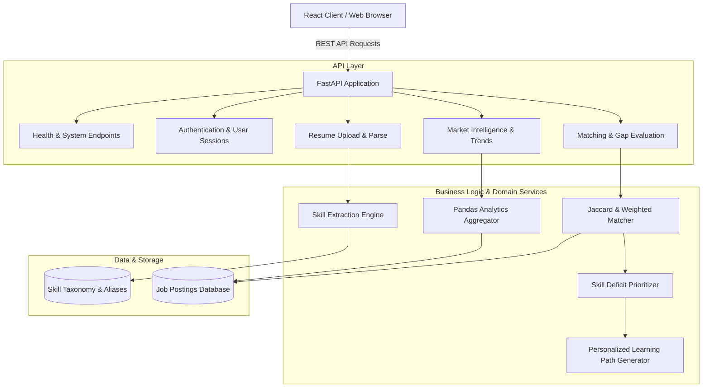

# System Architecture & Technical Design Document
## Project: Job Market Intelligence & Skill Gap Analyzer

---

### 1. High-Level Architecture Overview

The **Job Market Intelligence & Skill Gap Analyzer** is built upon a layered, domain-driven modular architecture. The application separates concerns into presentation, API interface, business domain services, analytical processing, and persistence layers to ensure testability, scalability, and clean maintainability.

```
+-----------------------------------------------------------------------+
|                             USER INTERFACE                            |
|             React SPA (Vite, Modern CSS, Responsive Design)           |
+------------------------------------+----------------------------------+
                                     |  HTTP / REST (JSON)
                                     v
+-----------------------------------------------------------------------+
|                              API LAYER                                |
|          FastAPI ASGI Server (Uvicorn, Routing, Middleware)           |
+--------+------------------+------------------+------------------------+
         |                  |                  |
         v                  v                  v
+-----------------+  +---------------+  +-------------------------------+
|  Resume Service |  | Job Matching  |  |   Market Analytics Engine     |
| (NLP / Regex /  |  |  & Gap Engine |  | (Skill Frequency, Salary Dist,|
| PDF Extraction) |  | (Weighted Jacc|  |    Role Affinity Matrix)      |
+--------+--------+  +-------+-------+  +---------------+---------------+
         |                   |                          |
         +-------------------+--------------------------+
                             |
                             v
+-----------------------------------------------------------------------+
|                          PERSISTENCE LAYER                            |
|        Relational Database (PostgreSQL / SQLite) & Data Models        |
|                  Jobs, Skills, Profiles, Roadmaps                     |
+-----------------------------------------------------------------------+
```

---

### 2. Component Hierarchy & Flow



---

### 3. Layer Responsibilities

| Layer | Primary Responsibility | Key Technologies / Libraries |
| :--- | :--- | :--- |
| **API Gateway & Routing** | Request routing, CORS handling, payload validation, error transformation | `FastAPI`, `Pydantic v2`, `Starlette` |
| **Domain Services** | Core matching mathematics, skill priority ranking, roadmap sequencing | Pure Python, `NumPy` |
| **NLP & Extraction** | Unstructured document parsing, token matching, entity recognition | `pdfminer.six`, `re`, Custom Taxonomy |
| **Data Analytics** | Aggregation of market trends, salary distributions, role correlations | `Pandas`, `NumPy`, `Scikit-learn` |
| **Persistence** | Relational storage for postings, users, profiles, and skills | `SQLAlchemy` / SQLite / PostgreSQL |

---

### 4. Architectural Decision Records (ADRs)

#### ADR-001: Selection of FastAPI as Primary Backend Framework
- **Status:** Accepted
- **Context:** The application requires high concurrency for document parsing, analytical query execution, and interactive dashboard responses, alongside automatic OpenAPI documentation.
- **Decision:** Adopt FastAPI atop Uvicorn.
- **Consequences:** Provides native async support, automated OpenAPI 3.0 docs (`/docs`), strong typing via Pydantic, and minimal boilerplate.

#### ADR-002: Modular Service-Layer Pattern
- **Status:** Accepted
- **Context:** Tight coupling of mathematical matching logic within route handlers reduces testability and increases technical debt.
- **Decision:** Route handlers in `app/api/` will exclusively handle HTTP parsing, parameter validation, and status codes. All business logic resides in dedicated services (`app/services/`).
- **Consequences:** Services can be unit tested without spinning up HTTP servers or mocking complex request contexts.

#### ADR-003: Pydantic v2 for Schemas & Runtime Validation
- **Status:** Accepted
- **Context:** Robust validation is essential for handling dirty job posting data and user resume payloads.
- **Decision:** Utilize Pydantic v2 with `pydantic-settings` for strongly-typed environment variables and API contracts.
- **Consequences:** High-performance Rust-backed validation and clean serialization.

#### ADR-004: In-Memory / SQLite Baseline Transitioning to PostgreSQL
- **Status:** Accepted
- **Context:** Development requires low friction in early phases while supporting scalable production deployment.
- **Decision:** Abstract database operations behind repository patterns, using SQLite for local development and PostgreSQL for containerized / production environments.
- **Consequences:** Rapid iteration on schemas in Days 1-5 without complex external database dependencies.
